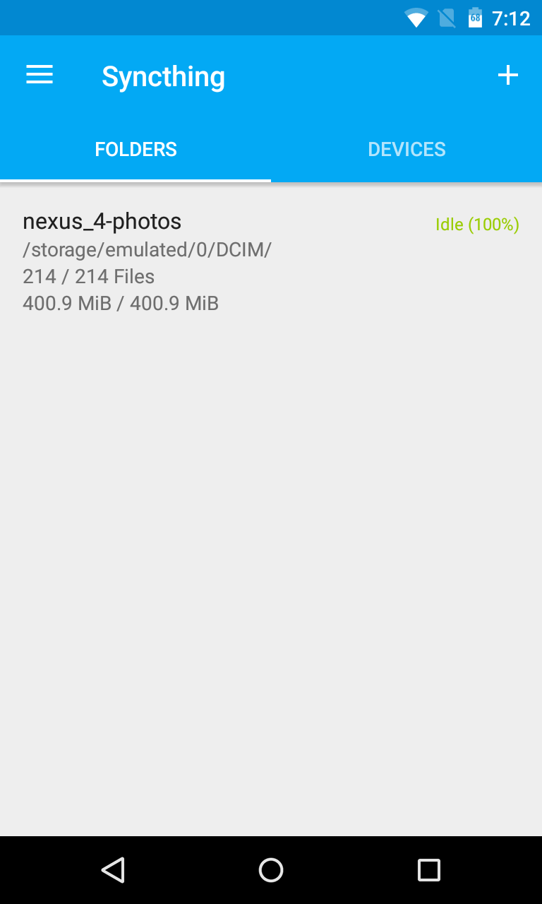

This a fork. There are no builds of it on GPlay nor F-Droid. Head to the "releases" section for builds. Please open an issue under this fork if you need help.

Important: Please don't file bugs at the upstream repository "syncthing-android" if you are using this fork.

# Major enhancements in this fork are:
- UI explains why syncthing is running or not running according to the run conditions set in preferences.
- A welcome wizard guiding you through initial setup on first launch or if mandatory prerequisites are missing like for example the storage permission.

# syncthing-android
android)

A wrapper of [Syncthing](https://github.com/syncthing/syncthing) for Android.

  

# Building

### Dependencies
- Android SDK (you can skip this if you are using Android Studio)
- Android NDK (`$ANDROID_NDK_HOME` should point at the root directory of your NDK)
- Go (see [here](https://docs.syncthing.net/dev/building.html#prerequisites) for the required version)

### Build instructions

Make sure you clone the project with
`git clone https://github.com/Catfriend1/syncthing-android.git --recursive`. Alternatively, run
`git submodule init && git submodule update` in the project folder.

A Linux VM, for example running Debian, is recommended to build this.

Build Syncthing using `./gradlew cleanNative buildNative`. Then use `./gradlew assembleDebug` or
Android Studio to build the apk.

# License

The project is licensed under the [MPLv2](LICENSE).
