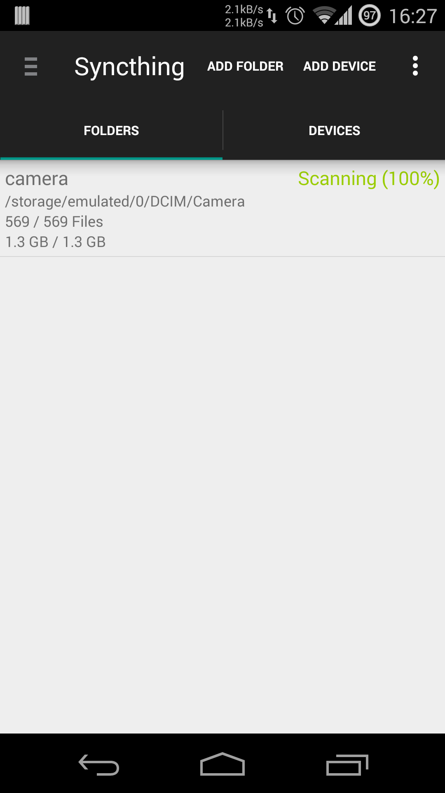
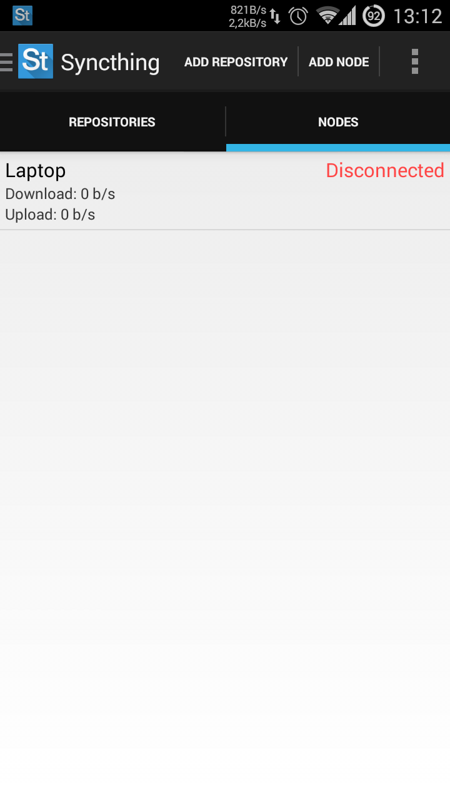

# syncthing-android

A wrapper of [syncthing](https://github.com/syncthing/syncthing) for Android.

 
 

 

# Translations

The project is translated on [Transifex](https://www.transifex.com/projects/p/syncthing-android/).

Translations can be updated using the [Transifex client](http://docs.transifex.com/developer/client/), using commands `tx push -s` and `tx pull -a`.

# Building

### Requirements
- sudo apt-get install build-essential
- Android SDK 19+ and the Android Support Repository are required.
- Use `git clone --recursive https://github.com/Nutomic/syncthing-android` to download the source and its submodules.

### Build instructions

Use `gradlew assembleDebug` to compile the APK.

Note: Gradlew is a gradle wrapper which allows to specify the gradle version. Use `gradle -b gradle/wrapper/build.xml wrapper` to create your own gradlew instance. Then add it to your path using `export PATH=$PATH:$(pwd)/gradle/wrapper`.

The build process follows three phases:
- It downloads and compiles Golang v1.3 for x86 and ARM cross-compilation: Syncthing-android depends on Syncthing "native" (https://github.com/syncthing/syncthing) and this requires Go v1.3.
- The Syncthing native libraries are compiled for the different architectures using `gradlew buildNative`.
- The final APK is built using the `gradlew assembleDebug` task.

To check for updated gradle dependencies, run `gradle dependencyUpdates`. Additionally, the git modules in `ext/syncthing/src/github.com/syncthing/syncthing` and `libraries/android-support-v4-preferencefragment` may need to be updated.

### Getting Syncthing without building natively

To get Syncthing app for Android running on you device/emulator the native syncthing binary has to be available. There are multiple ways to get the native syncthing binary:
- open the Syncthing apk (the one taken from the play store) running on your device as a zip, extract the `lib/` folder into your project directory and rename it to `libs/`.
- Depending on your target architecture, download `syncthing-linux-386`, `syncthing-linux-armv5`, `syncthing-linux-armv7` or `syncthing-linux-mips` from [syncthing releases](https://github.com/calmh/syncthing/releases), and extract the binary to `libs/x86/libsyncthing.so`, `libs/armeabi/libsyncthing.so`, `libs/armeabi-v7a/libsyncthing.so` or `libs/mips/libsyncthing.so` respectively.

### Development Notes

It is recommended to change the GUI and Listen Address ports for the debug app, eg to 8081 and 22001 respectively.

The syncthing backend used for this android application provides a web interface by default. It can be accessed via the Settings menu -> 'Web GUI'. It is quite helpful to access this web interface from your development machine. Read [android documentation](http://developer.android.com/tools/devices/emulator.html#redirection) on how to access the network of your emulator. Or use the following steps to connect to the single currently running emulator/AVD.
- `telnet localhost 5554`
- `redir add tcp:18080:8080`
- Start syncthing app on your emulator and access the web interface from you favorite browser of your development machine via [http://127.0.0.1:18080](http://127.0.0.1:18080)

# License

All code is licensed under the [MIT License](https://github.com/Nutomic/syncthing-android/blob/master/LICENSE).
