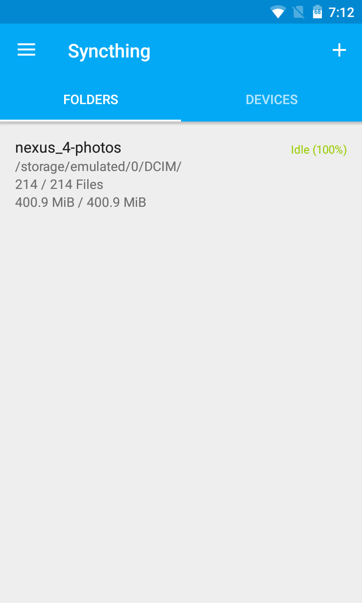

# syncthing-android

[](https://travis-ci.org/syncthing/syncthing-android)
[](https://opensource.org/licenses/MPL-2.0)
[](https://www.bountysource.com/teams/syncthing-android)

A wrapper of [Syncthing](https://github.com/syncthing/syncthing) for Android.

  

[](https://play.google.com/store/apps/details?id=com.nutomic.syncthingandroid) [](https://f-droid.org/app/com.nutomic.syncthingandroid)

# Translations

The project is translated on [Transifex](https://www.transifex.com/projects/p/syncthing-android/).

## Dev

Language mappings are defined in `.tx/config`, with the second code being the one from transifex. Google play supported languages: https://support.google.com/googleplay/android-developer/table/4419860. Android supported languages: https://stackoverflow.com/questions/7973023/what-is-the-list-of-supported-languages-locales-on-android. If a new language is added on transifex that's not supported, add them to `deleteUnsupportedPlayTranslations` in `app/build.gradle`.

# Building

## Dependencies

If you build using docker (see below) you don't need to setup these.

- Android SDK, with `$ANDROID_HOME` pointing to it (you can skip this if you are using Android Studio)
- Android NDK (you should install the required version (`ext.ndkVersionShared` in `./build.gradle`) with the usual tools, such that it's located within `$ANDROID_HOME/ndk/`).
- Go (see [here](https://docs.syncthing.net/dev/building.html#prerequisites) for the required version)
- Java Version 11 (you scan skip this if you are using Android Studio, otherwise you might need to set `$JAVA_HOME` accordingly)

## Build instructions

### Command line

Make sure you clone the project with
`git clone https://github.com/syncthing/syncthing-android.git --recursive`. Alternatively, run
`git submodule init && git submodule update` in the project folder.

Build Syncthing using `./gradlew buildNative`. Then use `./gradlew assembleDebug` or
Android Studio to build the apk.

### Docker

The release and CI builds happen in docker. You can run the same build with the following command:

``` sh
docker run  -v .:/mnt ghcr.io/syncthing/syncthing-android-builder:latest ./gradlew lint buildNative assembleDebug
```

If you do any changes to the build setup (e.g. SDK, Go, Java versions) or if you otherwise want to build the docker image locally, execute:

``` sh
docker build -t syncthing-android-builder -f ./docker/Dockerfile .
```

You can then just use `syncthing-android-builder` in the first command instead of the `ghcr.io/...` one to use the locally built image.

# License

The project is licensed under the [MPLv2](LICENSE).
