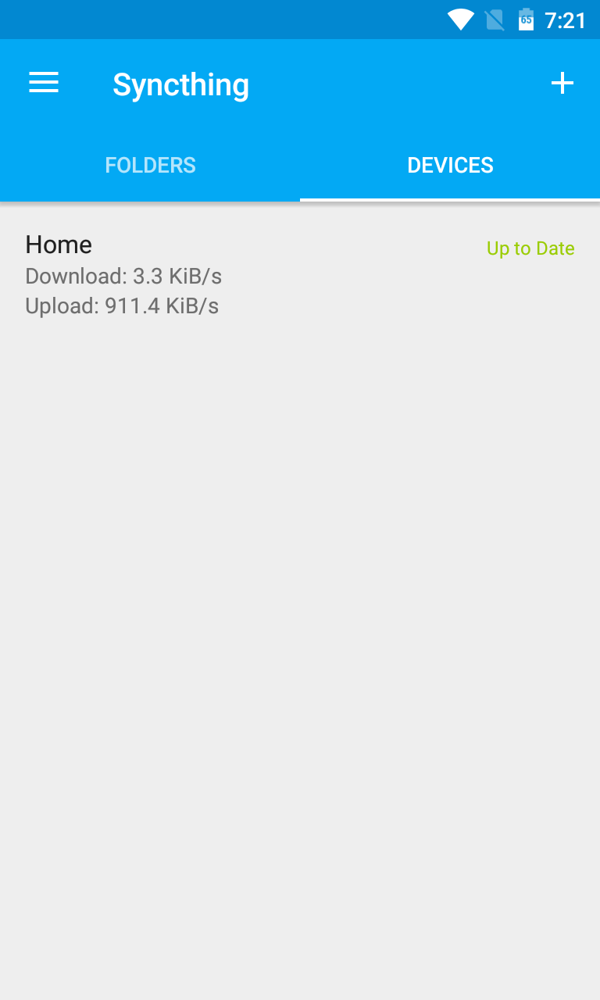

# syncthing-android

[](https://travis-ci.org/syncthing/syncthing-android)
[](https://opensource.org/licenses/MPL-2.0)
[](https://www.bountysource.com/teams/syncthing-android)

A wrapper of [Syncthing](https://github.com/syncthing/syncthing) for Android.

  

[](https://play.google.com/store/apps/details?id=com.nutomic.syncthingandroid) [](https://f-droid.org/app/com.nutomic.syncthingandroid)

# Translations

The project is translated on [Transifex](https://www.transifex.com/projects/p/syncthing-android/).

## Dev

Language mappings are defined in `.tx/config`, with the second code being the one from transifex. Google play supported languages: https://support.google.com/googleplay/android-developer/table/4419860. Android supported languages: https://stackoverflow.com/questions/7973023/what-is-the-list-of-supported-languages-locales-on-android. If a new language is added on transifex that's not supported, add them to `deleteUnsupportedPlayTranslations` in `app/build.gradle`.

# Building

These dependencies and instructions are necessary for building from the command
line. If you build using Docker or Android Studio, you don't need to set up and
follow them separately.

## Dependencies

1. Android SDK and NDK
    1. Download SDK command line tools from https://developer.android.com/studio#command-line-tools-only.
    2. Unpack the downloaded archive to an empty folder. This path is going
       to become your `ANDROID_HOME` folder.
    3. Inside the unpacked `cmdline-tools` folder, create yet another folder
       called `latest`, then move everything else inside it, so that the final
       folder hierarchy looks as follows.
       ```
       cmdline-tools/latest/bin
       cmdline-tools/latest/lib
       cmdline-tools/latest/source.properties
       cmdline-tools/latest/NOTICE.txt
       ```
    4. Navigate inside `cmdline-tools/latest/bin`, then execute
       ```
       ./sdkmanager "platform-tools" "build-tools;<version>" "platforms;android-<version>" "extras;android;m2repository" "ndk;<version>"
       ```
       The required tools and NDK will be downloaded automatically.

        **NOTE:** You should check [Dockerfile](docker/Dockerfile) for the
        specific version numbers to insert in the command above.
2. Go (see https://docs.syncthing.net/dev/building#prerequisites for the
   required version)
3. Java version 11 (if not present in ``$PATH``, you might need to set
   ``$JAVA_HOME`` accordingly)
4. Python version 3

## Build instructions

1. Clone the project with
   ```
   git clone https://github.com/syncthing/syncthing-android.git --recursive
   ```
   Alternatively, if already present on the disk, run
   ```
   git submodule init && git submodule update
   ```
   in the project folder.
2. Make sure that the `ANDROID_HOME` environment variable is set to the path
   containing the Android SDK (see [Dependecies](#dependencies)).
3. Navigate inside `syncthing-android`, then build the APK file with
   ```
   ./gradlew buildNative
   ./gradlew assembleDebug
   ```
4. Once completed, `app-debug.apk` will be present inside `app/build/outputs/apk/debug`.

**NOTE:** On Windows, you must use the Command Prompt (and not PowerShell) to
compile. When doing so, in the commands replace all forward slashes `/` with
backslashes `\`.

# License

The project is licensed under the [MPLv2](LICENSE).
