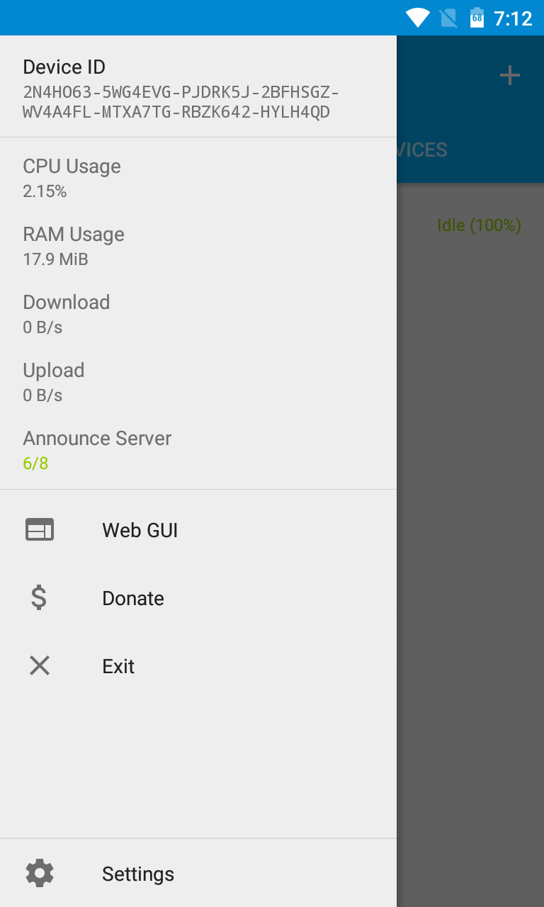

# syncthing-android

A wrapper of [Syncthing](https://github.com/syncthing/syncthing) for Android.

  

 

# Translations

The project is translated on [Transifex](https://www.transifex.com/projects/p/syncthing-android/).

# Building

### Dependencies
- Android SDK (you can skip this if you are using Android Studio)
- Android NDK (`$ANDROID_NDK_HOME` should point at the root directory of your NDK)
- Go (see [here](https://docs.syncthing.net/dev/building.html#prerequisites) for the required version)
- Java Version 8 (you might need to set `$JAVA_HOME` accordingly)

### Build instructions

Make sure you clone the project with
`git clone https://github.com/syncthing/syncthing-android.git --recursive`. Alternatively, run
`git submodule init && git submodule update` in the project folder.

Build Syncthing using `./gradlew buildNative`. Then use `./gradlew assembleDebug` or
Android Studio to build the apk.

# License

The project is licensed under the [MPLv2](LICENSE).
